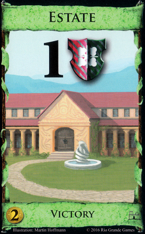

# Dominion is Great

My brother and I started working together on a card game about a year ago.  As kids, we would always play around with making different card games, just as something to do together.  A favorite of ours is (Dominion)[https://boardgamegeek.com/boardgame/36218/dominion].  If you haven't played it, it's a game in which you build your deck as you play, using the cards that you draw to put more cards into your deck.  The goal of the game is to get the most points at the end of the game.  Points are represented by the numbers on victory cards that are green.

During the game, however, these cards are (mostly) useless.  This creates a really interesting dynamic where you want to gain victory cards to win, but if you gain them too fast, another player can build a better deck than you, and beat you late game.  Start buying victory cards too late, though, and you might not be able to catch up to the amount of cards other players have already gained.  This is a fantastic way to adjust the speed of the game dynamically, and given the [huge set of cards that dominion and its expansions introduce](http://wiki.dominionstrategy.com/index.php/List_of_Cards_by_Qvist_Rankings), this mechanic is much needed.

I know what you're thinking.  If Dominion is so great, why don't I just marry it?  Well, there's a major problem that I have with it.

## 4 player Solitaire

Solitaire is a fun game.  It's a good way to pass the time with just a deck of cards, and while I always had my Game Boy (shoutout to Pokémon for getting me through those awkward early years), I have fond memories of my parents passing the time on rainy days with a game of Solitaire.  It's something to occupy your brain with, something to fight back boredom with.  It's not hurting you or anyone, but it's definitely anti-social.

Dominion, in many ways, is similar.  I think that every time I've played, conversation goes either 1 of 2 ways:  Players either just announce what they're doing on their turns, or talk about something completely unrelated to the game.  

## Introducing Conflict

When my brother and I started making a game together this time, a little older, and having played a few more games than Pokémon, we were in love with this deck building concept.  It was a great way to feel ownership of a deck, and card games had always had a soft spot in our hearts.

In Might, Magic, Money (working title), players build an army, fighting battles against one another to win a war.  Your army is represented by a deck of cards (no points for seeing this coming), and as you battle and gain territory, your army grows.  The key difference between the game we're developing and Dominion is that our game demands interaction and engagement.  Ambushes and deception are common, and leading your troops into bad territory because you weren't paying attention to the way that your opponents were deploying their armies is no excuse, and while some battles are harder to win than others, blindly flailing about is certainly no way to win a war.

Without going into too much more detail than that, it's been a year since we started, and I think that we have a strong core concept.  We've made physical prototypes, and we're working out details (balance, more playtesting, how do you win?), but I'm excited about where this might take us.